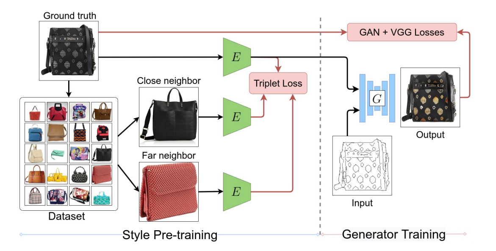

# StEP-Style-based-Encoder-Pre-training-for-Multi-modal-Image-Synthesis

This is un-official repository for ["StEP-Style-based-Encoder-Pre-training-for-Multi-modal-Image-Synthesis"](https://arxiv.org/abs/2104.07098) published in CVPR2021.

## Requirements
* python3.7+
* pytorch 1.7.0
* CUDA 11.0

## Usage
training a model
```bash
python3 main.py --config config.yml
```

testing a model
```bash
Not implmented yet
```

## Architecture

## Results


## Comments
 In this implementation, data set from ref 3 is used and canny edge detector is applied for outline images. To find close and far images, Bit is adapted. 
## Reference
1. spectral normalization : https://github.com/christiancosgrove/pytorch-spectral-normalization-gan/blob/master/spectral_normalization.py
2. unet : https://github.com/milesial/Pytorch-UNet
3. dataset : https://github.com/xthan/polyvore
4. bit : https://github.com/google-research/big_transfer